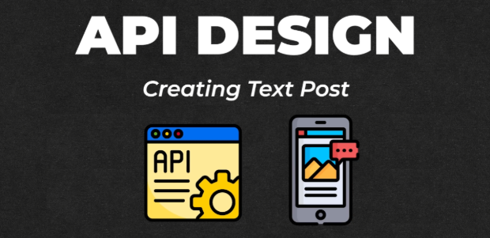
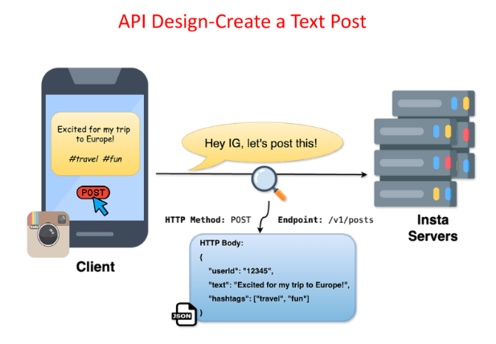

# **API Design for Creating a Text Post**

This section outlines the API design for creating a text post in the news feed system. It focuses on the structure and components of the API request.



---

## **Understanding the API Call**

When a user creates a text post, the client (e.g., mobile app, web browser) communicates with the server using an API call. This example uses the RESTful API design, which structures the request into three main parts:



1. **HTTP Method**

   * Indicates the action to be performed.  
   * For creating a new post, the **`POST`** method is used.  
2. **Endpoint**

   * Specifies the location on the server where the action should be performed.  
   * The endpoint for creating a post is **`/v1/posts`**.  
     * **`v1`** signifies version 1 of the API. Versioning helps manage updates and changes to the API.  
     * **`posts`** indicates that the action is related to posts.  
3. **Request Body**

   * Contains the data required to create the post.  
   * For a text post, the body includes:  
     * **`user_id`**: Identifies the user creating the post.  
     * **`text`**: The content of the text post.  
     * **`hashtags`**: A list of hashtags included in the post.

---

## **Example API Request**

Here is an example of an API request to create a text post:

POST /v1/posts HTTP/1.1    
Host: api.newsfeed.com    
Content-Type: application/json    
Authorization: Bearer \<access\_token\>  


```
{    
  "user\_id": "123456",    
  "text": "Exploring the world of APIs and system design\!",    
  "hashtags": \["\#APIDesign", "\#SystemDesign", "\#Coding"\]    
}  
```

This request performs the following actions:

* Sends a **POST** request to the **`/v1/posts`** endpoint.  
* Includes an **Authorization** header for authentication.  
* Specifies the **Content-Type** as JSON.  
* Contains the **user\_id**, **text**, and **hashtags** in the request body to create the text post.

---

### 🔙 [Back](../README.md)