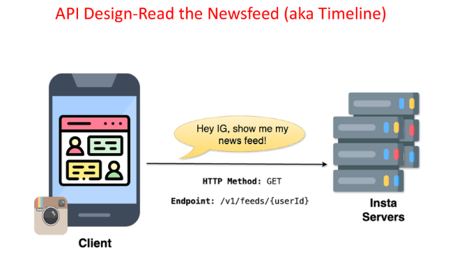

# **API Design for Reading the News Feed**

This section outlines the API design for reading the news feed (or timeline) in the news feed system. It focuses on the structure and components of the API request.


---


## **Understanding the API Call**

When a user wants to view their news feed, the client communicates with the server using an API call. This example also uses the RESTful API design:



---

### **Step 1: Choose the HTTP Method**

* Use the **`GET`** method because we are fetching data from the server (retrieving the news feed).

### **Step 2: Define the Endpoint**

* The endpoint for reading the news feed is:  
   **`/v1/feed/{user_id}`**  
  * **`v1`**: Signifies version 1 of the API.  
  * **`feed`**: Indicates that the action is related to fetching the news feed.  
  * **`{user_id}`**: Placeholder for the ID of the user whose feed is being requested.


### **Step 3: Request Body (Not Applicable)**

* **`GET`** requests typically do not have a request body.  
* The request is solely for retrieving data from the server.

---

## **Example API Request**

`GET /v1/feed/12345`

---

## **Expected Response**

The response will include the list of posts in the user's news feed. Each post contains metadata and content:

```
{  
  "user\_id": "12345",  
  "feed": \[  
    {  
      "post\_id": "67890",  
      "author\_id": "54321",  
      "content": "Sample post content",  
      "timestamp": "2025-01-22T10:30:00Z",  
      "likes": 150,  
      "comments": 25  
    },  
    {  
      "post\_id": "67891",  
      "author\_id": "98765",  
      "content": "Another sample post content",  
      "timestamp": "2025-01-22T11:00:00Z",  
      "likes": 75,  
      "comments": 10  
    }  
  \]  
}
```


---


## **Additional Parameters**

Optional query parameters can be added to the endpoint to customize the response:

* **`limit`**: Number of posts to retrieve (e.g., `/v1/feed/{user_id}?limit=20`).  
* **`offset`**: Pagination offset to retrieve older posts.  
* **`sort_order`**: Order of posts (`asc` for oldest first, `desc` for newest first).

---

This API design ensures efficient and customizable access to the user's personalized news feed.

---

### 🔙 [Back](../README.md)
