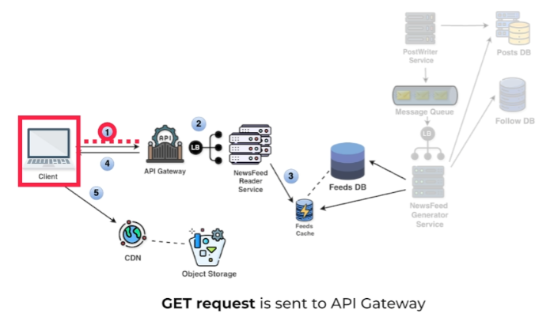
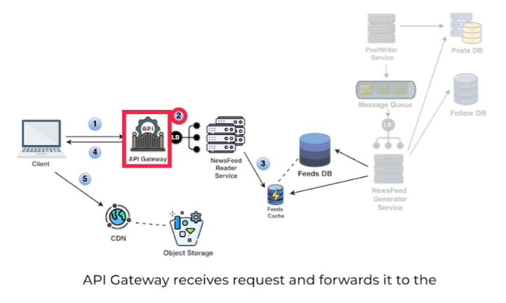
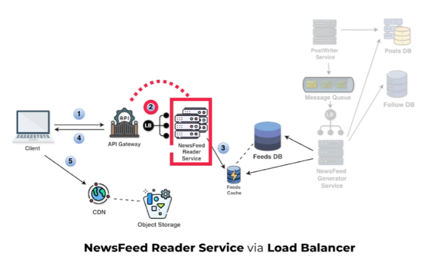
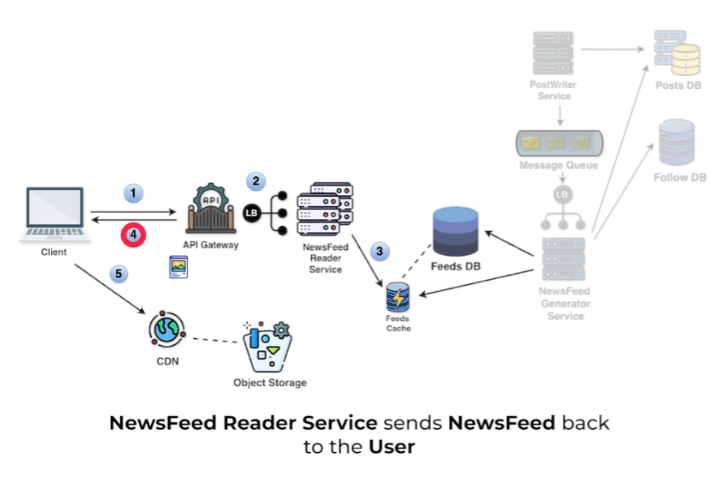
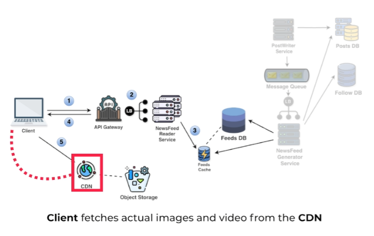

# **High-Level Design for Reading the News Feed**

This section outlines the high-level design for reading the news feed, focusing on efficient retrieval and display of posts.

---

## **System Components and Flow**

The following steps describe how the system handles a user's request to view their news feed:

### **Step 1: Client Requests News Feed**

* The client sends a **`GET`** request to the API gateway, targeting the `/v1/feed/{user_id}` endpoint.  
* This request is made to retrieve the latest news feed for the user.

### **Step 2: API Gateway Routing**

* The API gateway receives the request and forwards it to the Newsfeed Reader service via a load balancer.  
* This ensures that the request is routed efficiently, even under heavy load.

### **Step 3: Fetch News Feed from Cache**

* The Newsfeed Reader service retrieves the pre-built news feed for the user from the **Feeds Cache**.  
* The cache contains recent posts, including text, images, and video URLs, and is populated during post creation.

### **Step 4: Return News Feed with Media URLs**

* The Newsfeed Reader service sends the news feed data back to the client.  
* The news feed contains URLs pointing to images and videos stored in the object storage or CDN (Content Delivery Network). These URLs point to media content without the actual files being included.

### **Step 5: Fetch Media from CDN/Object Storage**

* The client uses the media URLs provided in the news feed to fetch the actual image and video content from the CDN.  
* If the content is not found in the CDN (e.g., if it's not cached), the client retrieves it directly from the object storage.

### **Step 6: Display News Feed**

* The client displays the complete news feed to the user, including text, images, and videos.  
* The text content is typically loaded first, while media content (images, videos) is loaded separately based on its availability.

---

## **Explanation of Delayed Media Loading**

The reason why images and videos sometimes load after the text in a news feed is that the client needs to make separate requests to fetch the media files from the CDN or object storage. This may introduce a slight delay in the display of media content, especially if the files are not cached or are stored in a remote location.

---

## **Benefits of Pre-built News Feeds and CDNs**

* **Reduced Latency:** Pre-built news feeds stored in the cache allow for quick retrieval and display, reducing wait times for the user.  
* **Improved Performance:** CDNs distribute media content closer to users, reducing loading times and improving the user experience.  
* **Scalability:** Caching and CDNs efficiently handle a large number of users and requests, ensuring that the system can scale without significant performance degradation.

---

This design optimizes the reading experience by leveraging caching and CDNs, reducing response times and ensuring a smooth display of content for users.

---

### 🔙 [Back](../README.md)