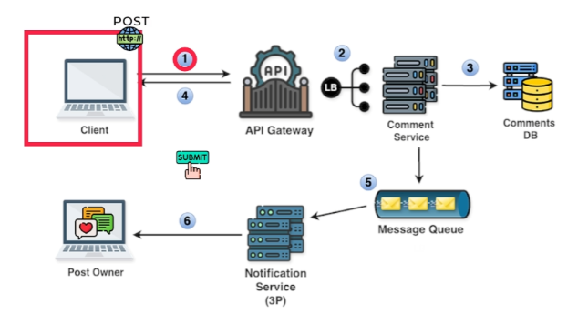
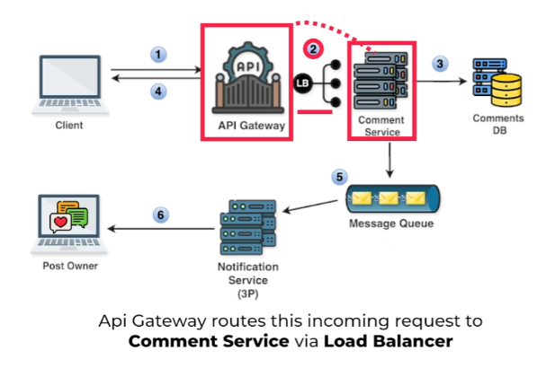
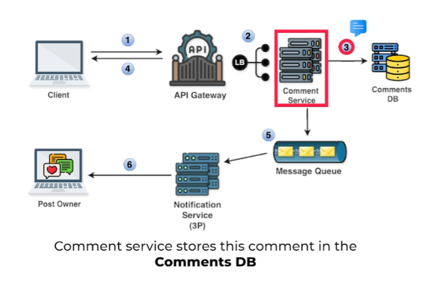
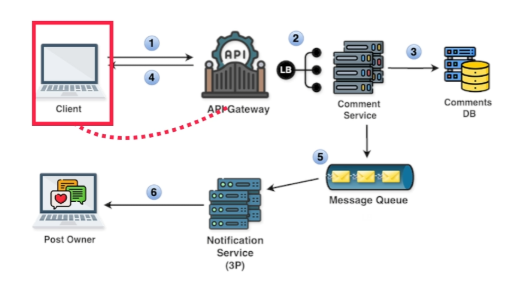
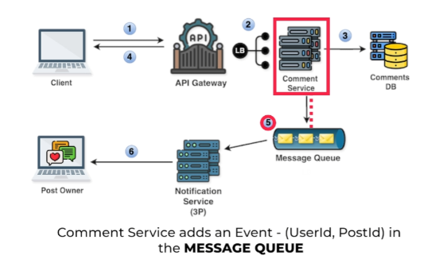
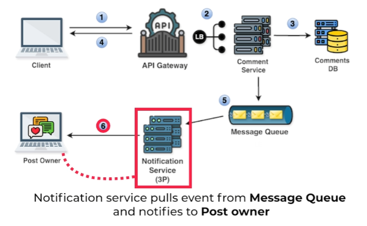
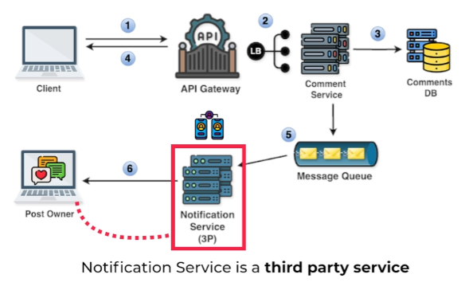

# **High-Level Design of Commenting on a Post**

This section outlines the high-level design for the commenting functionality in the news feed system, including the notification mechanism.

---

## **System Components and Flow**

The following steps describe how the system handles a user commenting on a post:

### **Step 1: Client Submits Comment**

* The user writes a comment and clicks "submit."  
* A **`POST`** request is sent to the API gateway, targeting the `/v1/comments` endpoint with the comment data.  
* This request includes the comment's content, along with identifiers for the user and post.

### **Step 2: API Gateway Routing**

* The API gateway receives the request and routes it to the **Comment service** via a load balancer.  
* The gateway ensures that the request reaches the appropriate service for processing.

### **Step 3: Comment Service Processing**

* The **Comment service** processes the comment data and stores it in the **Comments Database**.  
* This database holds all comment data, including the comment's content, associated post, and the user who made the comment.

### **Step 4: Confirmation**

* The client receives a confirmation that the comment has been successfully added.  
* The response ensures the user is aware their comment has been submitted.

### **Step 5: Add Event to Message Queue**

* The **Comment service** adds an event to the **message queue**, containing the `user_id` (the commenter) and `post_id` (the post being commented on).  
* This event will trigger a notification to the post owner.

### **Step 6: Notification Service**

---

* The **Notification service** (a third-party service) pulls the event from the message queue.  
* It uses the event data to identify the post owner and sends them a notification about the new comment.  
* This service ensures the post owner is alerted in real time about interactions with their content.

---

## **Notification Mechanism**

The system utilizes a **message queue** and a **third-party notification service** to asynchronously notify the post owner about new comments. This approach decouples the commenting process from the notification delivery, improving system efficiency and reliability.

By separating these concerns, the commenting functionality remains efficient while notifications are delivered in a timely and scalable manner.

---

This design ensures that comments are processed efficiently while the notification mechanism enhances user engagement with minimal impact on system performance.

---

[back](../README.md)