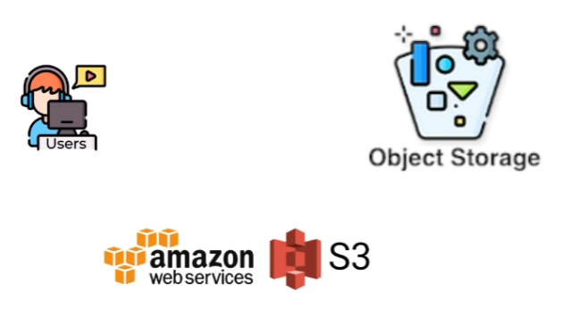
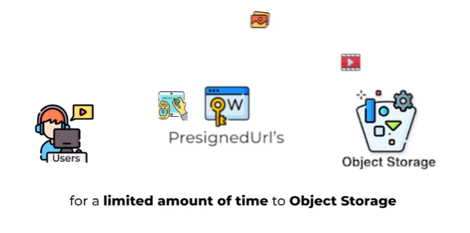

# **Deep Dive: Pre-signed URLs**

This section provides a detailed explanation of pre-signed URLs, their purpose, and their role in the news feed system's high-level design for creating media posts.

---

## **What are Pre-signed URLs?**

* **Definition:** Pre-signed URLs are specially crafted URLs that grant temporary permissions to users, allowing them to upload files directly to object storage services like Amazon S3.

* **Functionality:** When a client receives a pre-signed URL, it gains limited-time access to upload a specific object to a designated location in the object storage.

* **Signature:** These URLs are called "pre-signed" because they contain a cryptographic signature that authorizes the client's upload action. This signature verifies the client's permission and ensures the request's authenticity.

* **Temporary Access:** Pre-signed URLs have an expiration time, after which they become invalid. This limits the access window and enhances security.

---

## **Why Use Pre-signed URLs?**

Pre-signed URLs offer several benefits in the context of the news feed system:

1. **Faster Uploads:**

    

   * By enabling direct uploads to object storage, pre-signed URLs bypass the application server, reducing latency and improving upload speeds.  
   * This offloads the media upload process from the main application servers, freeing them to handle other requests and improving overall system performance.

2. **Secure and Temporary Access:**  
     
   

   * The temporary nature of pre-signed URLs enhances security by limiting the time window for uploads.  
   * This prevents unauthorized access or misuse of the URLs after they expire.  
   * It also reduces the risk of data breaches and ensures that only authorized users can upload content to the object storage.

---

## **Application in the News Feed System**

In the high-level design for creating image/video posts, the Pre-signed URL Generator service creates these URLs to facilitate direct uploads of media files to the object storage. This approach streamlines the media handling process, improves performance, and enhances security.

---

[back](../README.md)