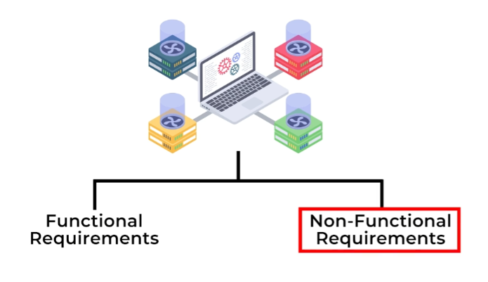
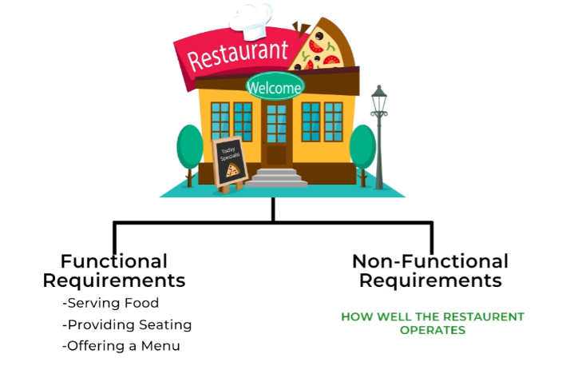
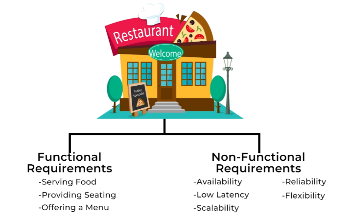

# **Non-Functional Requirements for a Notification System**

## **1\. Why Non-Functional Requirements Matter**

While functional requirements define what a system does, non-functional requirements specify how the system performs. These are crucial for ensuring the system operates reliably, efficiently, and at scale under real-world conditions. If the system lacks non-functional requirements, it won’t provide a seamless or enjoyable experience for users.

### **Poor User Experience**

Imagine if your restaurant was closed at random times, or during peak hours of dinner rush. Customers would be frustrated if they showed up and found the doors locked.

### **Good User Experience**

Just like a restaurant needs smooth operations to keep customers happy, your notification system needs robust non-functional requirements to ensure users get notifications reliably and quickly.

### **Restaurant Analogy**

A reliable schedule keeps customers coming back. They need to know when they can expect to get a table and have a meal.

Imagine you are building a restaurant. Functional requirements tell you the basics of what the restaurant does: serving food, providing seating, and offering a menu. These are essential, but they don’t guarantee a great dining experience. That’s where non-functional requirements come in, defining how well the restaurant operates.

---

## **2\. Key Non-Functional Requirements**

### **1\. Availability**

High availability ensures that users receive important notifications like OTPs or alerts without downtime. Imagine waiting for an OTP, but the system is down. That could lead to frustration, security risks, and a poor user experience.

* #### **Goal:**

  * Aim for "seven nines" availability (99.99999%) to ensure that the notification system is almost always accessible and operational.

* #### **Restaurant Analogy:**

  * A restaurant needs to be open consistently during its stated business hours. Customers would be frustrated if they showed up and found the doors locked.

### **2\. Low Latency**

Low latency means users receive notifications almost instantly. For urgent messages like OTPs, delays can impact the user experience or make the notification irrelevant.

* #### **Distinction from Availability:**

  * Availability ensures the system is up	 and running, while latency is the speed of delivery once the system is operational.

* #### **Restaurant Analogy:**

  * This is like how quickly customers get their food after ordering. If they have to wait too long, they’ll be annoyed and might not return.

### **3\. Scalability**

The system can handle a growing number of transactions or users without a slowdown or traffic spikes, like during big sales or events. For example, Black Friday, where the system should handle millions of notifications without crashing.

* #### **Example:**

  * Think of your favorite social media app during viral news. Even when everyone is active online, the notification system has to handle millions of messages simultaneously.

* #### **Restaurant Analogy:**

  * The restaurant handles rush hours like dinner time. If not, customers might wait too long for tables or service. Scalability ensures the restaurant can handle peak times smoothly.

### **4\. Reliability**

Reliability means customers get what they ordered every single time. No one wants mixed-up or poor-quality food.

* #### **Goal:**

  * Ensure notifications are accurate and consistent, with no duplicates or missed alerts. Imagine receiving two identical OTPs for one login—confusing, right?  
    

* #### **Restaurant Analogy:**

  * Deliver notifications accurately and without errors to ensure a seamless user experience. This is like offering vegetarian options or letting customers customize their meals to cater to different preferences.

### **5\. Flexibility**

Supporting various notification types (SMS, email, in-app) and adjusting delivery speed or preferences is crucial. For instance, if a user prefers promotional notifications at 8 a.m. on the first weekday of a month, the system should respect it.

#### **Importance:**

Flexibility prevents users from feeling overwhelmed by unwanted notifications, which could lead them to turn off notifications entirely.

---

## **3\. Conclusion**

Just like a well-run restaurant considers factors like availability, speed of service, capacity, consistency, and flexibility to ensure customer satisfaction, a successful notification system must address these non-functional requirements alongside its functional capabilities. This ensures reliable, timely, and efficient delivery of notifications while providing a polished and customizable user experience.

---

### 🔙 [Back](../README.md)