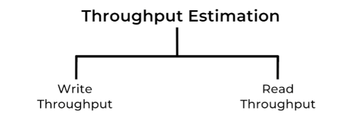
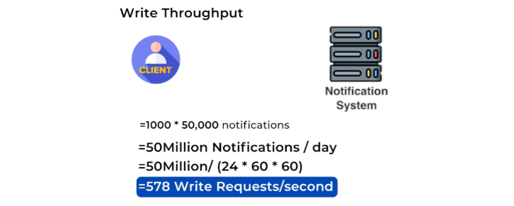
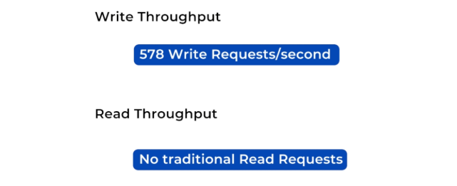

# **Capacity Planning: Throughput Estimation**

This document explains the concept of throughput and how to estimate it for a notification system. It focuses on understanding the volume of data flowing into and out of the system.

## **What is Throughput?**

Throughput measures the amount of data processed by a system within a specific timeframe. In the context of our notification system, it refers to the number of notifications generated and delivered per second.

## **Importance of Throughput Estimation**

1. **Scalability:** Ensures the system can handle increasing loads as the user base grows.  
2. **Performance:** Helps maintain quick response times, even during peak usage.  
3. **Reliability:** Prevents bottlenecks or crashes by predicting and planning for high data flow scenarios.

## **Factors Influencing Throughput**

1. **Number of Users:**  
   * Daily Active Users (DAU) and Monthly Active Users (MAU).  
2. **Notification Frequency:**  
   * Average number of notifications sent per user daily.  
3. **Delivery Channels:**  
   * Different channels (e.g., SMS, email, push notifications) may have unique throughput constraints.  
4. **Payload Size:**  
   * Larger payloads (e.g., multimedia messages) may require more bandwidth and processing power.

## **Steps to Estimate Throughput**

1. **Gather Metrics:**  
   * Collect data on DAU, MAU, and average notifications per user.  
2. **Analyze Peak Usage:**  
   * Identify peak times and calculate the maximum notification load.  
3. **Determine Delivery Latency Goals:**  
   * Define acceptable delivery timeframes for different notification types.  
4. **Simulate Load:**  
   * Use tools to simulate high traffic and measure the system's capacity.

## **Example Calculation**

1. **Metrics Assumed:**  
   * DAU: 1,000,000 users  
   * Average notifications per user daily: 5  

2. **Daily Throughput:**  
   * Total notifications \= 1,000,000 x 5 \= 5,000,000

3. **Per Second Throughput:**  
   * Assuming peak usage lasts for 2 hours (7,200 seconds):  
   * Throughput \= 5,000,000 / 7,200 ≈ 694 notifications/second
 
   

---

## **Optimizing Throughput**

1. **Use Caching:**  
   * Reduce processing time for frequently accessed data.  
2. **Optimize Code:**  
   * Ensure efficient algorithms for processing notifications.  
3. **Load Balancing:**  
   * Distribute traffic across multiple servers to avoid overloading.  
4. **Scale Infrastructure:**  
   * Add servers or increase bandwidth as needed.
---

## **Conclusion**

Estimating and optimizing throughput is critical to building a robust notification system. By understanding the data flow and planning for peak usage, we can ensure the system remains efficient, scalable, and reliable.

---

### 🔙 [Back](../README.md)