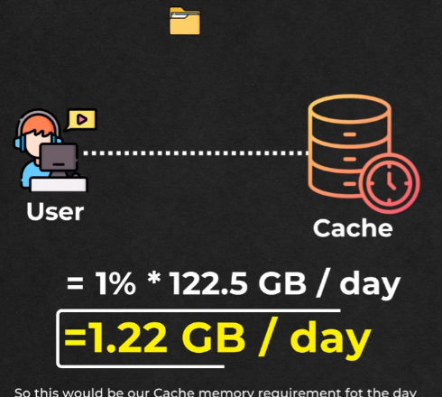
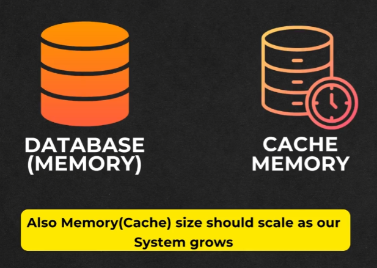

# **Capacity Planning: Memory Estimation**

This document explains the estimation of cache memory required for the notification system to optimize performance and data access speed.

## **Why Cache Memory Matters**

Accessing data directly from the database can be time-consuming. To improve speed and efficiency, we use cache memory. Cache memory acts as a temporary storage for frequently accessed data, reducing the need to repeatedly query the database.

Think of it like frequently used tools on your workbench—you keep them within easy reach to save time and effort. Similarly, cache memory ensures data that is often requested is readily available, enhancing the system's responsiveness.

## **Steps for Estimating Cache Memory**

1. **Identify Frequently Accessed Data:**

   * Determine the types of data most often requested by users (e.g., recent notifications, user preferences).  
2. **Analyze Data Size:**

   * Calculate the size of each frequently accessed data type.  
   * Example: If the average notification data is 2 KB and a user accesses 100 notifications daily, the data size is 200 KB per user.  
3. **Estimate Total Cache Requirement:**

   * Multiply the data size by the number of users accessing the cache simultaneously.  
   * Factor in additional overhead for cache management and storage.  
4. **Account for Eviction Policies:**

   * Decide on cache eviction strategies (e.g., Least Recently Used, First In First Out) to manage memory effectively.  
   * Reserve memory for handling temporary spikes in user activity.  
5. **Monitor and Scale:**

   * Continuously monitor cache performance and adjust the size based on usage patterns and load growth.

## **Example Calculation**

Suppose:

* The system has 1 million active users.  
* Each user accesses 500 KB of cached data daily.

Total Cache Requirement: 1,000,000 users \* 500 KB \= 500 GB of cache memory.

Adding a 20% buffer for overhead: 500 GB \* 1.2 \= 600 GB of total cache memory required.

## **Benefits of Accurate Cache Memory Estimation**

* **Enhanced Performance:** Speeds up data retrieval and reduces latency.  
* **Cost Efficiency:** Optimizes infrastructure costs by preventing over-provisioning.  
* **Scalability:** Ensures the system can handle user growth and peak loads effectively.

By following these steps and regularly analyzing usage patterns, the notification system can maintain high performance and reliability, ensuring a seamless user experience.

---

## **Estimating Cache Memory**

A common approach to estimate cache memory is to consider it as a percentage of the daily storage. In our case, we'll assume the cache memory requirement is 1% of the daily storage.

* **Daily Storage:** As calculated in the previous section, the daily storage for notification data is approximately 122.5 GB.  
* **Cache Memory (1%):** 122.5 GB \* 0.01 \= **1.22 GB per day**

## **Scaling Cache Memory**

It's important to remember that the cache memory size should scale as the system grows. If the number of users, notifications, or data volume increases, the cache memory requirements will also grow proportionally.

Future planning should include regular reviews of system metrics and periodic adjustments to the cache size to ensure optimal performance.

---

### 🔙 [Back](../README.md)