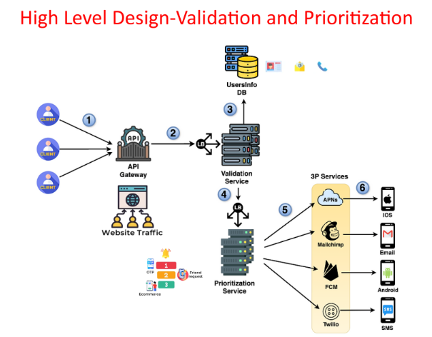

## **High-Level Design: Adding Validation and Prioritization Microservices**

This document refines the high-level design of the notification system by introducing new components: microservices for validation and prioritization, an API gateway, and a user information database.

---

## **Enhancing the Design**

The refined system includes the following components:

1. **API Gateway**  
   * Acts as a traffic controller, routing notification requests to the appropriate services.  
   * Centralizes request handling and enhances system organization.  
2. **User Info Database**  
   * Stores user data, such as usernames, email addresses, and phone numbers.  
   * Provides necessary data for validating notification requests.  
3. **Validation Service**  
   * Ensures notifications are sent to correct recipients by verifying user data against the database.  
4. **Prioritization Service**  
   * Assigns priority levels to notifications based on urgency, ensuring critical notifications (e.g., security alerts) are promptly delivered.

---

##  **Refined Notification Flow**

The revised flow of notifications is as follows:

1. **Client Request**

   * The client submits a notification request to the API Gateway.  
2. **API Gateway Routing**

   * Routes the request to the Validation Service.  
3. **Validation**

   * The Validation Service retrieves data from the User Info Database.  
   * If user data doesn’t match, the request is rejected.  
4. **Prioritization**

   * Valid requests proceed to the Prioritization Service.  
5. **Prioritization Logic**

   * Notifications are prioritized using predefined rules.  
6. **Delivery Service Routing**

   * The notification is forwarded to the relevant delivery service:  
     * **APNs** for iOS push notifications.  
     * **FCM** for Android push notifications.  
     * **Twilio** for SMS.  
     * **Mailchimp** for emails.  
7. **Delivery**

   * The notification is sent to the target user via the appropriate service.

---

## **Benefits of the Refined Design**

1. **Improved Efficiency**

   * The API Gateway organizes and streamlines request routing.  
2. **Enhanced Security**

   * Validation Service ensures secure and accurate recipient data.  
3. **Prioritized Delivery**

   * Urgent notifications are delivered promptly by the Prioritization Service.  
4. **Modularity and Scalability**

   * Microservices allow modular design and independent scaling of validation and prioritization.

---

This refined design enhances the notification system's functionality, security, and performance by incorporating specialized microservices and an API gateway to manage the flow of notifications effectively.

---

### 🔙 [Back](../README.md)