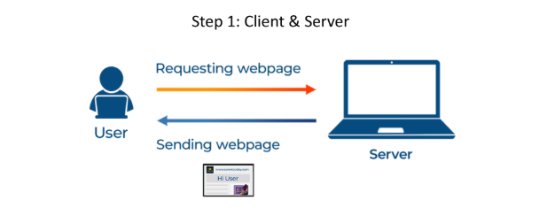

# **Client & Server**

### **Introduction**

Welcome, future system designers\! This is the first part of the ultimate system design template. Today, we're diving deep into the fascinating world of system design. And trust me, it's going to be an enjoyable ride.

### **The Beginning**

Imagine opening your browser, typing in a website address, and hitting enter. The website magically appears on your screen. Have you ever wondered how this magic happens? Well, first of all, it's not actually magic. It's simply the interaction between two key players: the client and the server.

### **Client**

A client is a device. It might be your phone, your computer, or any device requesting information.

### **Server**

A server is a computer or device that listens to the client. It understands the request and responds effectively. In this case, it's where your website is stored.

### **Request Flow**

1. **Request:** You, the client, make a request.  
2. **Processing:** The server processes the request.  
3. **Response:** The server returns the webpage to the client.

### **Further Details**

This flow is presented at a very high level. There's a lot more happening on the server side, which we'll explore soon.

### **Fun Fact**

Did you know the first website ever created is still online? You can visit it at info.cern.org. It was created by Tim Berners-Lee, considered the father of the World Wide Web, in 1991\.

---
### **Next Steps**

Stay tuned for the next part, where we'll delve deeper into the server details\!

---

### 🔙 [Back](../README.md)