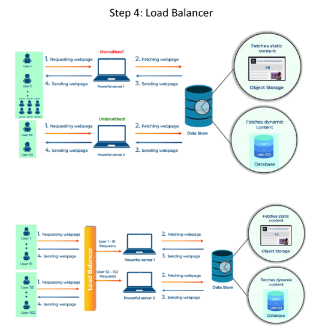

# **Load Balancer**

## **Introduction**

Welcome back, system design enthusiasts\! In our last session, we saw how adding a second server (horizontal scaling) helped handle increased user traffic. However, simply adding servers isn't enough. We need to ensure the workload is distributed effectively.

## **The Problem: Uneven Load Distribution**

Imagine adding a second server to handle extra users. If all the existing users remain on the first server, it remains overloaded while the second server sits idle. This uneven distribution leads to inefficient resource utilization.

## **The Solution: Load Balancer**

A load balancer acts like a traffic manager, directing incoming user requests to different servers. It ensures no single server is overwhelmed, keeping your system running smoothly.

## **How it Works**

1. **Incoming Request:** A user request arrives at the load balancer.  
2. **Distribution:** The load balancer distributes the request to one of the available servers.  
3. **Processing:** The chosen server processes the request and sends the response back to the load balancer.  
4. **Response:** The load balancer forwards the response to the user.

## **Analogy**

Think of a busy restaurant with two chefs. If all orders go to one chef, they'll be overworked while the other is idle. A load balancer is like a smart manager who ensures both chefs receive an equal number of orders, ensuring the kitchen runs efficiently.

## **Benefits of a Load Balancer**

* **Efficiency:** Distributes traffic evenly, maximizing resource utilization.  
* **Scalability:** Easily add or remove servers without disrupting service.  
* **Redundancy:** If one server fails, the load balancer redirects traffic to other servers, ensuring high availability.

---

### 🔙 [Back](../README.md)