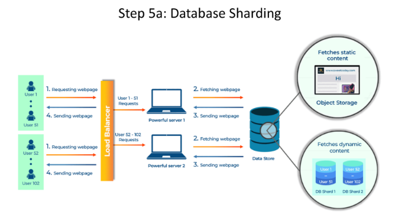

# **Database Sharding**

## **Introduction**

Welcome back, system design enthusiasts\! As we saw earlier, increased user traffic can overwhelm both servers and databases. We've addressed server overload with scaling. Now, let's tackle the database bottleneck.

## **The Problem: Database Overload**

A single database handling all user operations can struggle under heavy load. Imagine a small pantry in a busy restaurant trying to store all the ingredients – it's simply not enough.

## **The Solution: Database Sharding**

Database sharding is like splitting that pantry into multiple smaller ones. Instead of one overburdened database, we divide it into several smaller databases, each holding a portion of the data.

## **How it Works**

1. **Data Partitioning:** Divide the data into distinct "shards" based on specific criteria (e.g., user location, user ID).  
2. **Shard Distribution:** Store each shard on a separate database server.  
3. **Request Routing:** When a request arrives, the system determines the relevant shard and directs the request to the appropriate server.

## **Benefits of Database Sharding**

* **Scalability:** Handle massive datasets and user traffic by distributing the load.  
* **Performance:** Improve query performance by accessing smaller, focused datasets.  
* **Availability:** Increase fault tolerance – if one shard fails, the others remain operational.

## **Analogy**

Think of a library with millions of books. Instead of one giant, overwhelming section, the library divides the books into categories (fiction, non-fiction, etc.) and places them in separate areas. This makes it easier to find specific books and manage the collection.

## **Types of Sharding**

* **Horizontal Sharding:** Divide data across multiple servers based on rows (e.g., users with IDs 1-1000 on server 1, users 1001-2000 on server 2).  
* **Vertical Sharding:** Divide data based on columns (e.g., user profile information on one server, user posts on another).

### **Next Steps**

In the next session, we'll discuss different sharding strategies and explore the challenges and considerations of implementing database sharding. Stay tuned\!

---

[back](../README.md)