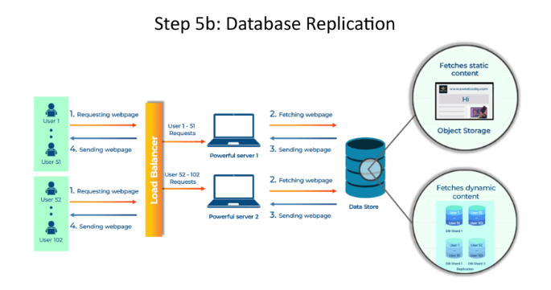

# **Database Replication**

## **Introduction**

Welcome back, system designers\! We've learned about database sharding to handle increased load. Now, let's explore another crucial technique for ensuring database reliability and availability: replication.

## **What is Database Replication?**

Replication involves creating copies of your database shards. These copies, called replicas, act as backups, ensuring that if one shard fails, the system can continue operating smoothly.

## **Why Replicate?**

* **Fault Tolerance:** If a shard crashes, its replica takes over, preventing data loss and downtime.  
* **Read Performance:** Distribute read operations across multiple replicas to improve performance.  
* **Disaster Recovery:** Replicas in geographically diverse locations protect against regional outages.

## **Analogy**

Imagine carrying a spare tire in your car. It adds weight, but if you get a flat tire, you can quickly swap it out and keep driving. Similarly, replicas ensure your system keeps running smoothly even if one shard fails.

## **Types of Replication**

* **Master-Slave Replication:** One master shard handles writes, and changes are replicated to slave shards for read operations.  
* **Master-Master Replication:** Both shards can handle reads and writes, providing higher availability.

## **Benefits of Database Replication**

* **High Availability:** Ensures the system remains operational even with failures.  
* **Data Protection:** Safeguards against data loss due to hardware or software issues.  
* **Improved Performance:** Potentially enhances read performance by distributing load.

## **Considerations**

* **Consistency:** Maintaining data consistency across replicas can be challenging.  
* **Complexity:** Setting up and managing replication adds complexity to the system.  
* **Cost:** Storing and maintaining multiple copies of data increases storage costs.

---
### **Next Steps**

In the next session, we'll delve deeper into different replication techniques and explore the trade-offs involved in choosing the right replication strategy. Stay tuned\!

---

[back](../README.md)