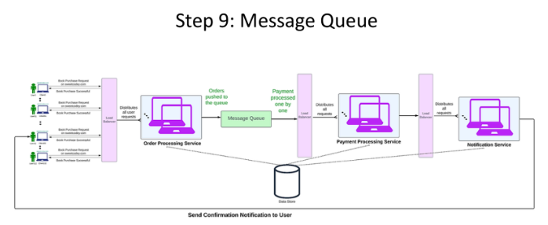

# **Message Queue**

## **Introduction**

Welcome, system design enthusiasts\! In this session, we'll explore a crucial concept in system design: the message queue.

## **Scenario: Handling Book Orders**

Imagine a high volume of users placing book orders on our website. Recall our microservices architecture with three services:

1. **Order Processing Service**  
2. **Payment Processing Service**  
3. **Notification Service**

## **The Challenge: Processing Bottleneck**

Processing payments takes time. If the Order Processing Service waits for each payment to be processed before handling the next order, it creates inefficiency and slows down the system.

## **The Solution: Message Queue**

A message queue acts as a buffer between services. It allows the Order Processing Service to quickly pass on the order information and move on to the next order without waiting for the payment to be processed.

## **How it Works**

1. **Receive Order:** The Order Processing Service receives an order.  
2. **Enqueue:** The service places the order information into the message queue.  
3. **Dequeue:** The Payment Processing Service retrieves orders from the queue one by one and processes the payments.

## **Benefits of Using a Message Queue**

* **Improved Efficiency:** The Order Processing Service can handle new orders without waiting for payment processing.  
* **Decoupling:** Services become independent of each other, reducing dependencies and improving fault tolerance.  
* **Asynchronous Communication:** Enables non-blocking communication between services.  
* **Increased Scalability:** Handle spikes in traffic by buffering requests in the queue.

## **Analogy**

Imagine a restaurant with a waiter (Order Processing Service) and a chef (Payment Processing Service). Instead of the waiter waiting for the chef to finish each dish before taking the next order, they use a system where orders are written down and placed in a queue for the chef to process. This allows the waiter to continue taking orders efficiently.

## **Use Cases for Message Queues**

* **Order Processing:** As in our example, handle order processing asynchronously.  
* **Notifications:** Send emails, SMS messages, or push notifications reliably.  
* **Task Management:** Distribute tasks among workers in a distributed system.  
* **Data Streaming:** Process streams of data asynchronously.

### **Next Steps**

In the next session, we'll explore different types of message queues, their features, and how to choose the right message queue for your system. Stay tuned\!

---

[back](../README.md)