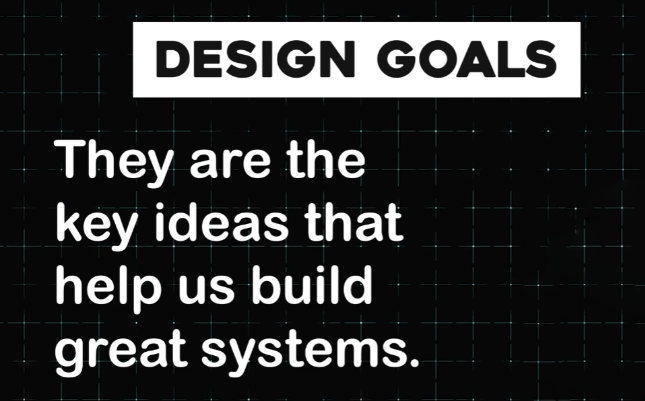

# **Design Goals Mind Map**

### **Central Goal:**

Building efficient systems

---

### **Main Branches:**

#### **1\. Functionality**

* The system works reliably and as expected.

---

#### **2\. Usability**

* The system is easy to understand and navigate.

---

#### **3\. Scalability**

* **Definition:** The ability to handle increasing users and data.

* **Analogy (Bakery):**

  * **1 cashier:** Represents the initial system.  
  * **More customers:** Increased demand.  
  * **Lines and frustration:** Scalability issues.  
  * **Solution:** Adding cashiers to meet demand.  
  * **Outcome:** 3 cashiers represent a scaled system.

---

#### **4\. Availability**

* **Definition:** The time the system is operational.

* **Analogy (24/7 Convenience Store):**

  * Always open and accessible.  
* **Example:** Online banking.

* **Key Metric:**

  * **"Nines" (e.g., 99.999% availability):**  
    * Equals 5 minutes of downtime per year.

---

#### **5\. Consistency**

* **Definition:** Ensuring everyone sees the same information at the same time.

* **Analogy (Teacher):**

  * A teacher announces a test.  
  * **Consistent:** All students hear the announcement at the same time.  
  * **Inconsistent:** Only some students hear it.  
* **Types of Consistency:**

  * **Strong Consistency:**

    * Information is updated immediately across all systems.  
    * **No delays.**  
    * **Example:** Bank balance updates instantly after a withdrawal.  
  * **Eventual Consistency:**

    * Information is updated gradually.  
    * Users may see outdated data temporarily until synchronization is complete.  
    * **Example:** Social media likes on a post taking a few seconds to reflect.

---

#### **6\. Performance**

* Ensures the system responds quickly to user requests.

* **Key Metrics:**

  * **Latency:** Time taken to process a single request.  
  * **Throughput:** Number of requests the system can handle per second.  
* **Example:**

  * A search engine delivering results in milliseconds.

---

#### **7\. Reliability**

* The system consistently performs its intended function under expected conditions.

* **Example:**

  * A messaging app reliably delivering messages even during high traffic.

---

#### **8\. Security**

* Protects the system and user data from unauthorized access or breaches.

* **Key Aspects:**

  * **Authentication:** Ensures only authorized users can access the system.  
  * **Encryption:** Secures data in transit and at rest.  
  * **Example:** A banking app requiring two-factor authentication (2FA).

---

#### **9\. Maintainability**

* The system can be easily updated, debugged, and enhanced over time.

* **Example:**

  * Modular codebases allowing quick bug fixes and feature updates.

---

#### **10\. Cost Efficiency**

* Balances performance and scalability with cost-effectiveness.

* **Example:**

  * Using auto-scaling services to reduce infrastructure costs during low traffic.

---

[back](../README.md)
