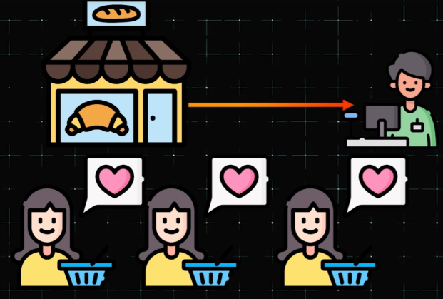
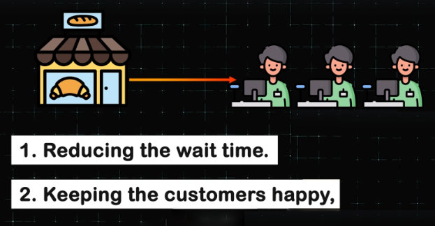

# **Scalability: A Key Design Goal**

## **Introduction**

Scalability is one of the most important goals in system design. To understand it better, let’s explore a relatable example.

## **A Simple Example: The Neighborhood Bakery**

### **The Initial Setup**

Imagine a small, cozy bakery in your neighborhood. When it first opened, the bakery had only one cashier, and everything ran smoothly. Customers would come in, place their orders, pay at the counter, and leave satisfied with their delicious pastries.

### **Rising Popularity**

Over time, the bakery gained more popularity. The line of customers grew longer, and waiting times increased. This led to frustration among customers, with some even leaving because they couldn’t afford the time to wait.

### **The Solution: Scaling Up**

To address this issue, the bakery owner decided to open additional checkout counters. Instead of one cashier, there were now three. This change made it much easier to handle the growing crowd, reducing wait times and keeping customers happy.

By adding more checkout counters, the bakery effectively scaled up to meet the increasing demand.

## **Scalability in Technology**

Just like the bakery, technical systems also need to scale as more users join. Scalability in tech refers to a system’s ability to handle increased workload smoothly as demand grows.

A well-designed system can scale up more easily, ensuring it serves more users without performance issues. This adaptability is crucial for maintaining efficiency and user satisfaction as demand evolves.

---
## **Conclusion**

Scalability is not just about managing growth; it’s about maintaining quality and performance as demand increases. Whether it’s a bakery or a technical system, scaling up effectively is key to success.

---

[back](../README.md)