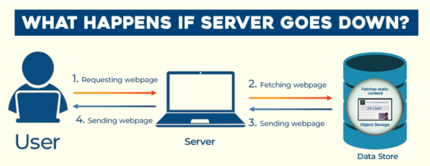

# **Fault Tolerance: Avoiding a Single Point of Failure**

## **Introduction**

Welcome back, design enthusiasts. Today, we will discuss an essential design goal: ensuring our system does not have a single point of failure. Let’s explore this concept with analogies and examples.

## **Understanding Single Point of Failure**

### **The Bridge Analogy**

Imagine crossing a bridge supported by a single pillar. If that pillar collapses, the entire bridge falls. This pillar is the single point of failure for the bridge. If it fails, the whole structure becomes unusable.

### **In System Design**

Similarly, in system design, we strive to avoid any single point of failure that could bring the entire system to a halt.

## **Example: A Website Flow**

Let’s consider a website as an example:

1. A user tries to open the website.  
2. The client sends a request for a web page.  
3. A server handles the request and fetches the web page from a data store.

Now, what happens if the server goes down? The entire website becomes inaccessible. Here, the server is the single point of failure. If it fails, the entire flow stops working.

## **Avoiding Single Point of Failure**

To prevent this, we introduce redundancy by adding more servers. This ensures that:

* If one server fails, others can take over.  
* Continuous operation is maintained even during partial failures.

By doing so, we make the system fault-tolerant.

## **Examples of Fault-Tolerant Systems**

1. **Server Redundancy:** If one server in a data center fails, another server takes over, keeping the website accessible.  
2. **Data Center Redundancy:** If an entire data center goes down, traffic is rerouted to another data center, ensuring uninterrupted service.

---
Fault-tolerant design ensures that systems remain operational despite failures, enhancing reliability and user experience.

---

[back](../README.md)