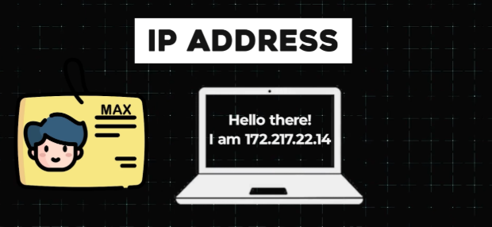
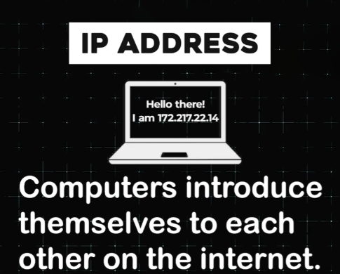
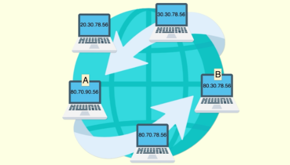
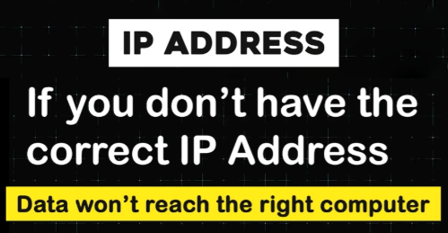

# **IP Addresses: The Foundation of Internet Communication**

## **Introduction**

Welcome back, amazing design enthusiasts\! Today, we’ll dive into an essential component that allows computers to communicate over the internet: **IP addresses**. Just as every person in the world is identified by their name, each computer on the internet is identified by its unique IP address.

## **What is an IP Address?**

### **The Basics**

An IP address is a numerical label assigned to every device connected to the internet. For example:

**172.217.22.14**

This is an example of an IP address. Imagine a computer introducing itself as, “Hello there, I am 172.217.22.14.” This is how devices recognize and communicate with each other on the internet.

### **Complex Formats**

Sometimes, IP addresses can look more complicated, such as:

**`2001:0db8:85a3:0000:0000:8a2e:0370:7334`**

These are examples of IPv6 addresses. While they might seem intimidating, they serve the same purpose as simpler IPv4 addresses, ensuring each device has a unique identifier.

### **Domain Names**

To simplify, we use domain names like **example.com** instead of remembering long strings of numbers. Domain names are human-readable equivalents of IP addresses.

## **How Do IP Addresses Work?**

### **Unique Identification**

Every device on the internet has a unique IP address, ensuring that data knows exactly where to go. Think of it as sending a letter—if the address isn’t correct, the letter won’t reach its destination. Similarly, if the IP address isn’t accurate, data won’t reach the right computer.

### **IPv4 and IPv6**

* **IPv4**: The traditional format, e.g., `172.217.22.14`.  
* **IPv6**: A newer format designed to handle the growing number of devices, e.g., `2001:0db8:85a3:0000:0000:8a2e:0370:7334`.

---
## **Conclusion**

IP addresses are the foundation of how the internet functions, enabling billions of devices to communicate seamlessly. Without them, the internet as we know it wouldn’t exist. They ensure that data reaches the right destination, making global communication possible.

---

[back](../README.md)