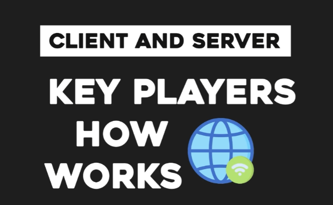
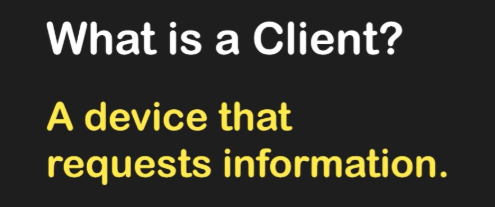
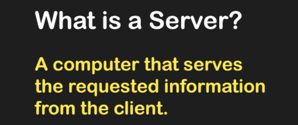
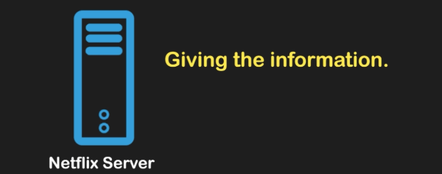
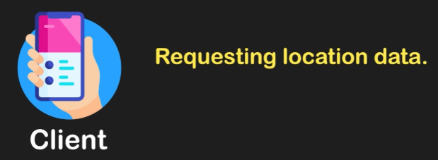
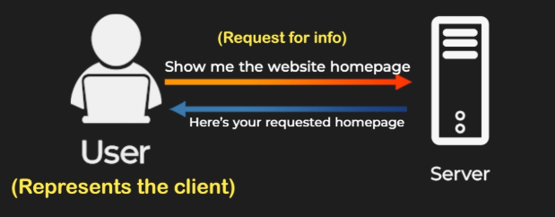
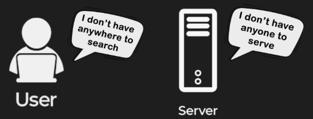

# **The Client-Server Relationship: How the Internet Works**

## **Breaking It Down: Client and Server**

### **What is a Client?**

A client is a computer or device that requests information. Examples include:

* Laptops  
* Smartphones  
* Smart TVs

### **What is a Server?**

A server is a computer that provides or "serves" the requested information to the client. Servers store the data and resources that clients request.

## **Everyday Examples**

### **Example 1: Streaming Movies**

Imagine you’re sitting on your couch, streaming movies on Netflix. Here:

* **Client**: Your smart TV is requesting the movie data.
 

* **Server**: Netflix’s servers deliver the movie data back to your TV.

### **Example 2: Using Google Maps**

When you use your phone to get directions, the setup is:

* **Client**: Your phone is requesting location data.  
* **Server**: Google Maps’ servers provide the necessary location information.

## **How It Works: An Example Interaction**

### **Step-by-Step Process**

1. **Client Request**: A user on their laptop (the client) sends a request: “Show me the website homepage.”  
2. **Server Response**: The server hosting the website processes the request and responds with: “Here is your requested homepage.”  
3. **Display**: The client receives the data and displays the homepage on the user’s screen.

---
## **Conclusion**

Without servers, clients would have no source to fetch the information they need. Similarly, without clients, servers would have no requests to fulfill. Together, they form the backbone of how the internet operates, enabling seamless communication and data exchange.

---

### 🔙 [Back](../README.md)