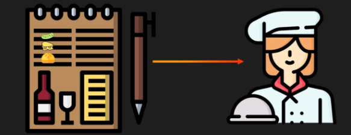

# **GraphQL API: A Restaurant Analogy**

## **Introduction**

In this document, we will explore the concept of a GraphQL API using a restaurant analogy. This will help clarify how GraphQL functions and how it differs from traditional REST APIs.
 
---

## **GraphQL API: The Customization Analogy**

Imagine you're at a restaurant. Instead of simply choosing from a fixed menu, you decide to customize your meal. Perhaps you want a burger with extra pickles, extra cheese, and a gluten-free bun.

* The waiter takes note of your custom order and communicates it to the chef.

* The chef prepares the meal exactly as per your request.

* The waiter then brings the tailored meal to you, exactly how you asked for it.

This is how GraphQL operates in the digital world.

## **Comparing REST and GraphQL**

### **REST API**

With REST, you typically have a fixed menu of options. If you want something specific, like a burger with extra pickles, extra cheese, and a gluten-free bun, you would need to make separate requests for each item:

1. One request for the burger.  
2. Another for extra pickles.  
3. Another for extra cheese.  
4. And one more for the gluten-free bun.

Then, you would need to assemble everything yourself.

### **GraphQL API**

In contrast, GraphQL allows you to customize your request. You describe your complete custom order in a single query, and the server (like the chef) processes this detailed request and delivers exactly what you need in one go.

* **Client Request:** Just like ordering your customized burger in one request, GraphQL allows you to request multiple pieces of information in one query.  
* **Server Response:** The server understands the full context of your request and delivers the exact data you need.

## **Example of GraphQL in Action**

In a typical GraphQL request:

* The client sends a single query to the server asking for a block of content.  
* This content could include related posts, authors, and their recent comments.

In this analogy, it’s like asking the waiter to bring your customized burger, along with the pickles, cheese, and gluten-free bun, all in one go.

---
## **Conclusion**

GraphQL simplifies the process by allowing clients to request exactly what they need in a single query, eliminating the need for multiple requests and responses. It empowers users with flexibility and precision when interacting with APIs, much like customizing a meal in a restaurant.

---

### 🔙 [Back](../README.md)
