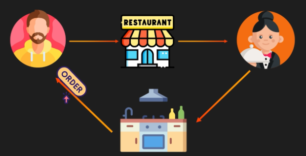

# **REST APIs: A Restaurant Analogy**

## **Introduction**

In this document, we will explore the concept of REST APIs through a relatable restaurant analogy. This analogy simplifies the concept and illustrates how REST APIs facilitate communication between systems.

## **REST APIs: The Restaurant Menu Analogy**

Imagine you are at a restaurant:

1. You browse the menu, which lists specific dishes available.  
2. You decide to order a burger and fries.  
3. You place your order with the waiter, who communicates it to the kitchen.  
4. The waiter then brings your meal back to you.

Just like a restaurant menu lists predefined dishes you can order, **REST APIs** define standardized ways for computers to communicate and interact with a server.

## **The Standardized "Menu" of REST APIs**

In REST APIs, the "menu items" represent specific types of requests you can make. These operations are standardized using HTTP methods, just like a restaurant has standard dishes.

### **Common REST API Operations**

1. **HTTP GET**:

   
     
   * Purpose: To request data from the server.  
   * Analogy: Asking the waiter to bring you a dish from the menu.

2. **HTTP POST**:  

   

   * Purpose: To add new data to the server.  
   * Analogy: Asking the waiter to add a special request or a new item to your order.

3. **HTTP PATCH**:

   

   * Purpose: To update existing data on the server.  
   * Analogy: Asking the waiter to modify your order, such as adding extra cheese to your burger.

4. **HTTP DELETE**:  
     
    

   * Purpose: To remove data from the server.  
   * Analogy: Canceling an item from your order before it is prepared.

---
## **Conclusion**

REST APIs, like a restaurant menu, offer a structured and standardized way to interact with a server. The predefined HTTP methods ensure clarity and consistency, making it easier for systems to communicate and perform operations efficiently.

---

[back](../README.md)
